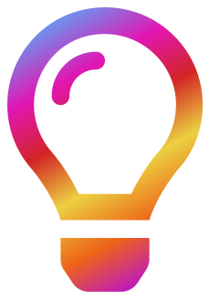

<a name="readme-top"></a>

[![Contributors][contributors-shield]][contributors-url]
[![Forks][forks-shield]][forks-url]
[![Stargazers][stars-shield]][stars-url]
[![Issues][issues-shield]][issues-url]
[![MIT License][license-shield]][license-url]
[![LinkedIn][linkedin-shield]][linkedin-url]

<!-- PROJECT LOGO -->
<br />
<div align="center">
  <a href="https://github.com/BahnMiFPS/tuneteasers">
    
  </a>

<h3 align="center">Tune Teasers</h3>

  <p align="center">
    A multiplayer music quiz game built with React, Express, Socket.IO, and Spotify API integration.
    <br />
    <br />
    <br />
    <a href="https://tuneteasers.vercel.app/">View Demo</a>
    ·
    <a href="https://github.com/BahnMiFPS/tuneteasers/issues">Report Bug</a>
    ·
    <a href="https://github.com/BahnMiFPS/tuneteasers/issues">Request Feature</a>
  </p>
</div>

<!-- TABLE OF CONTENTS -->
<details>
  <summary>Table of Contents</summary>
  <ol>
    <li>
      <a href="#about-the-project">About The Project</a>
      <ul>
        <li><a href="#built-with">Built With</a></li>
      </ul>
    </li>
    <li>
      <a href="#getting-started">Getting Started</a>
      <ul>
        <li><a href="#prerequisites">Prerequisites</a></li>
        <li><a href="#installation">Installation</a></li>
      </ul>
    </li>
    <li><a href="#usage">Usage</a></li>
    <li><a href="#roadmap">Roadmap</a></li>
    <li><a href="#contact">Contact</a></li>
    <li><a href="#acknowledgments">Acknowledgments</a></li>
  </ol>
</details>

<!-- ABOUT THE PROJECT -->

## About The Project

[![Product Name Screen Shot][product-screenshot]](https://tuneteasers.vercel.app/)

Tune Teasers is an exciting party game that brings together groups of friends for a thrilling and fast-paced challenge. In this game, players compete against each other to guess the name of a song associated with a music clip played within a customizable time frame.

With the growing popularity of online quizzes and trivia games, Tune Teasers caters specifically to music enthusiasts who are seeking a fun and interactive music trivia platform. It provides a dedicated space where players can test their music knowledge, engage in interactive gameplay features, and enjoy a vibrant and intuitive user interface.

The project aims to deliver a captivating experience, offering a wide range of music-related questions that keep players entertained and engaged. Whether you're a music aficionado or simply enjoy friendly competition, Tune Teasers offers an opportunity to showcase your skills and enjoy a fun-filled gaming experience with friends.

<p align="right">(<a href="#readme-top">back to top</a>)</p>

### Built With

##### Frontend:

[](https://reactjs.org/)
[](https://material-ui.com/)
[](https://reactrouter.com/)

##### Backend:

[](https://expressjs.com/)
[](https://socket.io/)

##### API Integration:

[](https://developer.spotify.com/documentation/web-api/)

## Getting Started

This is an example of how you may give instructions on setting up your project locally.
To get a local copy up and running follow these simple example steps.

### Prerequisites

Before you can run the Tune Teasers application, make sure you have the following software installed on your machine:

- Node.js: Install the latest version of Node.js by visiting the [official Node.js website](https://nodejs.org/) and following the installation instructions for your operating system.

- Sign up for a free account at [Spotify for Developers](https://developer.spotify.com/)

  1. Head to https://developer.spotify.com/dashboard and click "Create App"

  2. Fill in your app informations. Just use http://localhost:3001 for Redirect_URI if you dont have one.
  3. Click "Settings" to go to your app's settings and save your _Client ID_ and _Client Secret_ for later

### Installation

1. Clone the repo

   ```sh
   git clone https://github.com/BahnMiFPS/tuneteasers.git
   ```

## Client

1. Install NPM packages
   ```sh
   npm install
   ```
2. Make an `.env` file using this template below
   ```js
   REACT_APP_DEPLOYMENT_URL = ""
   REACT_APP_LOCAL_URL = "http://localhost:3001"
   NODE_ENV = "development"
   ```
3. Run the server on your local:
   ```sh
   npm start
   ```

## Server

1. Cd into the server folder

   ```sh
   cd server/
   ```

2. Install NPM packages
   ```sh
   npm install
   ```
3. Make an `.env` file using this template below
   ```js
   SPOTIFY_ID = "YOUR SPOTIFY CLIENT ID"
   SPOTIFY_SECRET = "YOUR SPOTIFY CLIENT SECRET"
   DEPLOYMENT_URL = ""
   LOCAL_URL = "http://localhost:3000"
   NODE_ENV = "development"
   ```
4. Run the server on your local:

   ```sh
   npm run dev
   ```

5. Enjoy Tune Teasers with your friends or you can use another browser (or the private mode of your browser) to create another peer
<!-- USAGE EXAMPLES -->

## Usage

As a user, I can:

- Join a room and participate in multiplayer music quiz games.
- Create a room and invite friends to join and play together.
- Choose different game modes, such as Slow, Fast, or Custom.
- Select specific song numbers for the quiz to customize the gameplay experience.
- Pick music playlists from different countries and genres.
- Answer questions related to music, including identifying songs.
- See my score and ranking on the leaderboard during the game.
- Communicate with other players using the chat feature.
- Start the game and progress through multiple rounds of questions.
- View the correct answers and learn more about the music trivia.
- Leave a room when the game is finished.

<p align="right">(<a href="#readme-top">back to top</a>)</p>

<!-- ROADMAP -->

## Roadmap

- [ ] Implement the ability for users to filter multiple music categories for a more customized quiz experience.
- [ ] Enhance user experience by implementing persistent user sessions to allow for seamless continuation of gameplay across sessions.
- [ ] Reduce reliance on the Spotify API by integrating additional music sources or expanding the existing database of questions.
- [ ] Implement scaling strategies to handle increased traffic and user load:
  - [ ] Explore running socket.io on multiple Node instances to improve performance and handle a higher number of concurrent connections.
  - [ ] Replace the default in-memory adapter with a Redis adapter or another compatible adapter to enable better scalability and handling of large amounts of data.

Please refer to the [open issues](https://github.com/BahnMiFPS/tuneteasers/issues) for a complete list of proposed features, bug fixes, and known issues.

<p align="right">(<a href="#readme-top">back to top</a>)</p>

<!-- CONTACT -->

## Contact

Quang Vu Luong - [@LinkedIn](https://linkedin.com/in/quangvu-dev) - luongquangvu97@gmail.com

Project Link: [https://github.com/BahnMiFPS/tuneteasers](https://github.com/BahnMiFPS/tuneteasers)

<p align="right">(<a href="#readme-top">back to top</a>)</p>

<!-- ACKNOWLEDGMENTS -->

## Acknowledgments

[CoderSchool's Tech Tank Competition](https://www.linkedin.com/feed/update/urn:li:activity:7072542829855576064/) hosted by _CoderSchool x Grab_

- [Mr. Tuan Anh Hoang (Luke)](https://www.linkedin.com/in/lukehoang195/)
- My CoderSchool Bootcamp Mentor, Mr. Tam Vu
- [Ms. Ally Nguyen](https://www.linkedin.com/in/ally-nguyen-67a81520b/)

<p align="right">(<a href="#readme-top">back to top</a>)</p>

<!-- MARKDOWN LINKS & IMAGES -->
<!-- https://www.markdownguide.org/basic-syntax/#reference-style-links -->

[contributors-shield]: https://img.shields.io/github/contributors/BahnMiFPS/tuneteasers.svg?style=for-the-badge
[contributors-url]: https://github.com/BahnMiFPS/tuneteasers/graphs/contributors
[forks-shield]: https://img.shields.io/github/forks/BahnMiFPS/tuneteasers.svg?style=for-the-badge
[forks-url]: https://github.com/BahnMiFPS/tuneteasers/network/members
[stars-shield]: https://img.shields.io/github/stars/BahnMiFPS/tuneteasers.svg?style=for-the-badge
[stars-url]: https://github.com/BahnMiFPS/tuneteasers/stargazers
[issues-shield]: https://img.shields.io/github/issues/BahnMiFPS/tuneteasers.svg?style=for-the-badge
[issues-url]: https://github.com/BahnMiFPS/tuneteasers/issues
[license-shield]: https://img.shields.io/github/license/BahnMiFPS/tuneteasers.svg?style=for-the-badge
[license-url]: https://github.com/BahnMiFPS/tuneteasers/blob/master/LICENSE.txt
[linkedin-shield]: https://img.shields.io/badge/-LinkedIn-black.svg?style=for-the-badge&logo=linkedin&colorB=555
[linkedin-url]: https://linkedin.com/in/quangvu-dev
[product-screenshot]: https://i.imgur.com/wKbqwWZ.png
[Next.js]: https://img.shields.io/badge/next.js-000000?style=for-the-badge&logo=nextdotjs&logoColor=white
[Next-url]: https://nextjs.org/
[React.js]: https://img.shields.io/badge/React-20232A?style=for-the-badge&logo=react&logoColor=61DAFB
[React-url]: https://reactjs.org/
[Vue.js]: https://img.shields.io/badge/Vue.js-35495E?style=for-the-badge&logo=vuedotjs&logoColor=4FC08D
[Vue-url]: https://vuejs.org/
[Angular.io]: https://img.shields.io/badge/Angular-DD0031?style=for-the-badge&logo=angular&logoColor=white
[Angular-url]: https://angular.io/
[Svelte.dev]: https://img.shields.io/badge/Svelte-4A4A55?style=for-the-badge&logo=svelte&logoColor=FF3E00
[Svelte-url]: https://svelte.dev/
[Laravel.com]: https://img.shields.io/badge/Laravel-FF2D20?style=for-the-badge&logo=laravel&logoColor=white
[Laravel-url]: https://laravel.com
[Bootstrap.com]: https://img.shields.io/badge/Bootstrap-563D7C?style=for-the-badge&logo=bootstrap&logoColor=white
[Bootstrap-url]: https://getbootstrap.com
[JQuery.com]: https://img.shields.io/badge/jQuery-0769AD?style=for-the-badge&logo=jquery&logoColor=white
[JQuery-url]: https://jquery.com
